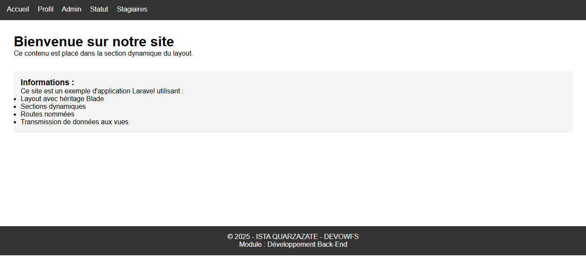

# Laravel Views & Blade Template Engine 
---
<p align="center">
  
</p>


---

## 📚 Description

Projet Laravel démontrant l'utilisation des vues et du moteur de template **Blade**.
Exercices pratiques réalisés dans le cadre du module **Développement Back-End** à l’**ISTA Quarzazate (DEVOWFS)**.

## 🎯 Objectifs

* Maîtriser la création et l'organisation des vues Laravel
* Utiliser Blade pour le templating
* Implémenter l’héritage de layouts
* Gérer la transmission de données aux vues
* Utiliser les structures de contrôle Blade

## 📋 Exercices réalisés

### ✅ Exercice 1 : Vues de base

* Création de vues simples (Home, Profile)
* Transmission de données aux vues

### ✅ Exercice 2 : Organisation des vues

* Création d’un dossier **Admin**
* Vue `dashboard` dans `resources/views/admin/`

### ✅ Exercice 3 : Authentification

* Vue `status` avec les directives `@auth` et `@guest`
* Affichage conditionnel selon l’état de connexion

### ✅ Exercice 4 : Boucles et données

* Vue `stagiaires` avec liste dynamique
* Utilisation de `@foreach` pour itérer sur un tableau

### ✅ Exercice 5 : Layouts et héritage

* Création d’un layout principal (`app.blade.php`)
* Héritage de layout avec `@extends`
* Sections dynamiques avec `@yield` et `@section`

## 🏗️ Structure du projet

```
resources/views/
├── layouts/
│   └── app.blade.php        # Layout principal avec header/footer
├── admin/
│   └── dashboard.blade.php  # Vue d'administration
├── Home.blade.php           # Page d'accueil simple
├── home.blade.php           # Page d'accueil avec layout
├── profile.blade.php        # Page profil avec données
├── status.blade.php         # Page de statut d'authentification
└── stagiaires.blade.php     # Liste des stagiaires
```

## 🛠️ Technologies utilisées

* **Laravel** 8 / 9 / 10
* **Blade Template Engine**
* **PHP** 7.4+
* **HTML5 / CSS3**
* **Git** (contrôle de version)

## 🚀 Installation et utilisation

### 🔧 Prérequis

* PHP >= 7.4
* Composer
* Laravel CLI (optionnel)

### 📦 Étapes d'installation

```bash
# 1. Cloner le projet
git clone https://github.com/VOTRE-USERNAME/Laravel-Blade-Exercises.git
cd Laravel-Blade-Exercises

# 2. Installer les dépendances
composer install

# 3. Configurer l'environnement
cp .env.example .env
php artisan key:generate

# 4. Lancer le serveur
php artisan serve
```

➡️ Ouvrir **[http://localhost:8000](http://localhost:8000)** dans le navigateur.

## 📁 Fichiers importants

### 📌 Routes (`routes/web.php`)

```php
Route::get('/', function () {
    return view('home');
})->name('home');

Route::get('/profile', function () {
    return view('profile', [
        'nom' => 'Nassiri Ilyas',
        'metier' => 'Formateur'
    ]);
})->name('profile');

Route::get('/admin', function () {
    return view('admin.dashboard');
})->name('admin.dashboard');

Route::get('/status', function () {
    return view('status');
})->name('status');

Route::get('/stagiaires', function () {
    return view('stagiaires', [
        'stagiaires' => ['Ali', 'Sara', 'Omar', 'Khadija']
    ]);
})->name('stagiaires');
```

### 📐 Layout principal

`resources/views/layouts/app.blade.php`

```html
<!DOCTYPE html>
<html lang="fr">
<head>
    <meta charset="UTF-8">
    <title>@yield('title', 'Mon Application')</title>
</head>
<body>
    <header>...</header>

    <div class="content">
        @yield('content')
    </div>

    <footer>...</footer>
</body>
</html>
```

### 🧩 Exemple d’héritage

`resources/views/home.blade.php`

```blade
@extends('layouts.app')

@section('title', 'Accueil')

@section('content')
    <h1>Bienvenue sur notre site</h1>
    <p>Ceci est un exemple d’héritage de layout.</p>
@endsection
```

## 🔥 Fonctionnalités Blade démontrées

### Structures de contrôle

```blade
@if / @elseif / @else / @endif
@switch / @case / @break / @default
@isset / @empty
@auth / @guest
```

### Boucles

```blade
@for / @foreach / @forelse / @while
```

Variable `$loop` : `$loop->first`, `$loop->last`, `$loop->index`

### Layouts & sections

```blade
@extends('layouts.app')
@section('content')
@yield('content')
```

## 📸 Routes disponibles

| Route           | URL           | Description                     |
| --------------- | ------------- | ------------------------------- |
| Home            | `/`           | Page d'accueil avec layout      |
| Profile         | `/profile`    | Page profil avec données        |
| Admin Dashboard | `/admin`      | Interface d'administration      |
| Status          | `/status`     | Statut de connexion utilisateur |
| Stagiaires      | `/stagiaires` | Liste des stagiaires            |

## 📖 Concepts appris

* **Séparation des responsabilités** : logique métier vs présentation
* **Réutilisabilité** : layouts et composants partagés
* **Sécurité** : échappement automatique avec `{{ }}`
* **Productivité** : Blade vs PHP pur
* **Organisation** : structure claire des vues

## 👨‍🏫 Contexte pédagogique

Projet réalisé dans le cadre du module **Développement Back-End**
Filière **DEVOWFS – ISTA Quarzazate**
Sous la direction du formateur **Nassiri Ilyas**.

## 👤 Auteur

**Ayoub Aguezar**
Étudiant en Développement Web Full Stack
ISTA Quarzazate – Filière DEVOWFS

## 🤝 Contribution

Les contributions sont les bienvenues :

1. Fork le projet
2. Créer une branche
3. Commiter vos changements
4. Pousser vers la branche
5. Ouvrir une Pull Request

## 📄 Licence

Ce projet est sous licence **MIT**. Voir le fichier LICENSE pour plus de détails.
